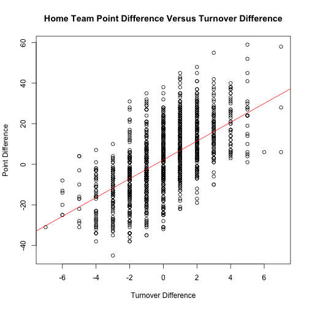
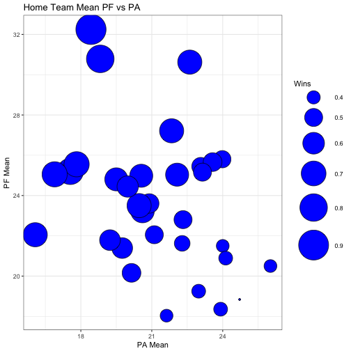
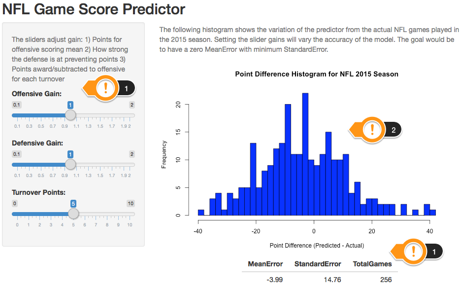

NFLGamePredictor
========================================================
author: Donald Hescht
date: January 21, 2017
width: 1440
height: 900
transition: linear 

NFL Game Score Predictor

This presentation covers the Shiny application implement, proof of concept, adhering to the customer supplied requirements.  The prototype will be described followed by a phase two and three proposal.  

The Proof of Concept prototype can be found here:

https://donhescht.shinyapps.io/NFLGamePredictor/

NFL Game Score Predictor (Analysis)
========================================================
The follow team analysis fostered the simple PoC solution.
- Historical Turnovers Forced (TOF) improves a team's points.
- Historical Points For PF (offense) predicts future scoring.
- Historical Points Allowed PA (defense) predicts opponent scoring.

NFL Game Predictor (Design)
========================================================
- Created NFL Database using https://github.com/BurntSushi/nflgame 
- Formula below uses data from 2009-2014 to predict score difference
- Compare actual game score difference to predicted.

<small>
$$
Pts\left(t,o\right)=PFGain\cdot PFAvg\left( Team \right)\; \cdot \; PAGain\cdot \left( \frac{PAAvg\left(O\right)}{PA.NFL.Avg} \right)\; \; +\; \; TOGain\cdot TOF\left( team \right)
$$
</small>

NFL Game Score Predictor (Implementation)  
========================================================

***
- PoC predicting 2015 season
- Solution is self documenting
- Sliders:
    - 1) Sliders control equation gain
    - 2) The Histogram of game score errors
    - 3) Summary of Histogram stats 

NFL Game Score Predictor (Next Phases)
========================================================
- Predictor shows promise for predicting winner and spread.
- Phase 2 ($100K)
    - Improve model with machine learning
    - Increase NFL features for learning
    - Add page to show prediction of next game week
- Phase 3 (+$300K)
    - Implement model for Web and Mobile devices
    - Use Boot Strap as framework

